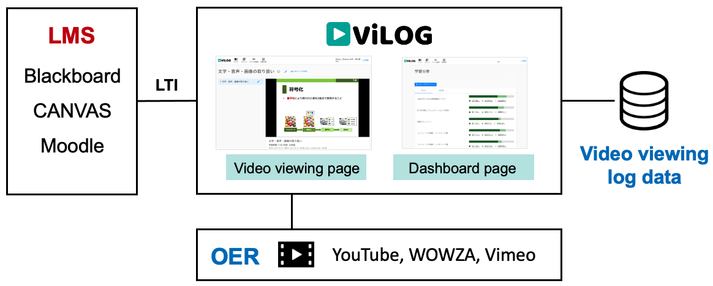
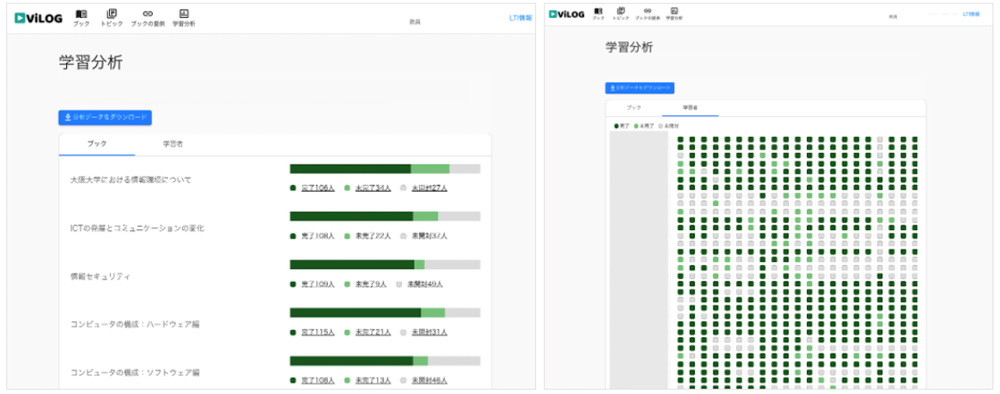

#  ViLOG: Video viewing LOG analytics system

[English](README-en.md) | [Japanese](README-ja.md)

ViLOG (Video viewing LOG analytics system) is an open-source micro-content platform with video viewing analytics, developed as the first step of an ongoing research project on engagement analytics for video-based learning. It delivers short video-based learning units ("topics," assembled into "books") through any LTI-compliant learning management system (LMS) and makes learners' progress visible at the level of individual topics.

ViLOG is the University of Osaka's deployment of a code base shared by three institutions. It is a fork of [npocccties/chibichilo](https://github.com/npocccties/chibichilo) (CHiBi-CHiLO, maintained by the NPO Cyber Campus Consortium TIES), which in turn derives from [RCOSDP/GakuNinLMS-LTI-MC](https://github.com/RCOSDP/GakuNinLMS-LTI-MC) (LTI-MC, developed by the National Institute of Informatics). Each institution runs its own instance; the code is released under the MIT License.

ViLOG has been in operational use at the University of Osaka since 2020, supporting a compulsory, university-wide course in information literacy and computing taken by approximately 3,000 students each year, as well as the university's training program for newly appointed faculty.

Initial development was supported by the MEXT "Innovation Platform for Society 5.0" Program, Grant Number JPMXP0518071489.

## Functionality

### LTI Tool Provider

ViLOG is an [LTI 1.3 (LTI Advantage)](https://www.1edtech.org/standards/lti) tool provider. It uses Deep Linking to place books into LMS courses, the Names and Role Provisioning Services (NRPS) to synchronize rosters, and the Assignment and Grade Services (AGS) to return topic completion to the LMS as activity completion. It works with Moodle, Blackboard, and Canvas, and supports YouTube, Vimeo, and Wowza as video sources.

### Video Viewing Behavior Dashboard

The dashboard gives instructors an overview of students' progress at any point during a course. Progress is shown for each book, topic, and learner at three levels: "Completed," "Attempts" (started but not finished), and "Unopened" (not yet started). Topics with high repeat-viewing counts are also visible, and all data can be exported for further analysis. Learners see a completion mark for each topic and the segments of each video they have watched.

### Video Viewing Log Collection

A module based on video.js collects detailed viewing behavior. It saves events such as play, pause, seek, and playback-speed changes every 10 seconds, in accordance with the log format defined by the National Institute of Informatics (NII). Logs are aggregated per topic rather than per video file.

## Citation

Shizuka Shirai, Masumi Hori, Masako Furukawa, Mehrasa Alizadeh, Noriko Takemura, Haruo Takemura and Hajime Nagahara. 2022. Design of open-source video viewing behavior analysis system. In Companion Proceedings 12th International Conference on Learning Analytics & Knowledge (LAK22), March 23-25, 2022, online. Society for Learning Analytics Research, 82. https://www.solaresearch.org/core/lak22-companion-proceedings/
